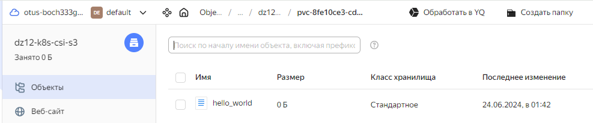

# Выполнено ДЗ №12

 - [x] Основное ДЗ

## В процессе сделано:
- Данное задание будет выполняться в managed k8s в Yandex cloud
- Разверните managed Kubernetes cluster в Yandex cloud любым удобным вам способом, конфигурация нод не имеет значения
- Создайте бакет в s3 object storage Yandex cloud. Он будет использоваться для монтирования volume внутрь подов.
- Создайте ServiceAccount для доступа к бакету с правами, которые необходимы согласно инструкции YC и сгенерируйте ключи доступа.
- Создайте secret c ключами для доступа к Object Storage и приложите манифест для проверки ДЗ
- Создайте storageClass описывающий класс хранилища и приложите манифест для проверки ДЗ
- Установите CSI driver из репозитория
- Создайте манифест PVC, использующий для хранения созданный вами storageClass с механизмом autoProvisioning и приложите его для проверки ДЗ
- Создайте манифест pod или deployment, использующий созданный ранее PVC в качестве volume и монтирующий его в контейнер пода в - произвольную точку монтирования и приложите манифест для проверки ДЗ.
- Под в процессе работы должен производить запись в примонтированную директорию. Убедитесь, что файлы действительно сохраняются в ObjectStorage.

## Выполнение задания:
- Подготовка рабочего окружения

        yc storage bucket create k8s-csi-s3
        yc storage bucket update --name dz12-k8s-csi-s3 --grants grant-type=grant-type-account,grantee-id=aje5e2628bn218a745ks permission=permission-full-control

- Настройка Container Storage Interface (https://yandex.cloud/ru/docs/managed-kubernetes/operations/volumes/s3-csi-integration#manual_1)
    1. Создайте файл secret.yaml, в котором укажите настройки доступа для Container Storage Interface:
            vi ./kubernetes-csi/secret.yaml
        В полях accessKeyID и secretAccessKey укажите полученные ранее идентификатор и значение секретного ключа.
    2. Создайте файл с описанием класса хранилища storageclass.yaml:
            vi ./kubernetes-csi/storageclass.yaml
        Чтобы использовать существующий бакет, укажите его имя в параметре bucket. 
    3. Клонируйте GitHub-репозиторий, содержащий актуальный драйвер Container Storage Interface:
            git submodule add https://github.com/yandex-cloud/k8s-csi-s3.git kubernetes-csi/k8s-csi-s3
    4. Создайте ресурсы для Container Storage Interface и класс хранилища:
            kubectl create -f secret.yaml 
            kubectl create -f k8s-csi-s3/deploy/kubernetes/provisioner.yaml 
            kubectl create -f k8s-csi-s3/deploy/kubernetes/driver.yaml 
            kubectl create -f k8s-csi-s3/deploy/kubernetes/csi-s3.yaml 
            kubectl create -f storageclass.yaml
    5. Создаем динамический PersistentVolume, которые будут использовать бакеты Object Storage.
            vi ./kubernetes-csi/pvc.yaml
            kubectl get pvc csi-s3-pvc
## Как проверить работоспособность:
 - Запуск тестового пода:

        kubectl apply -f pod.yaml

 - Проверка того, что файлы успешно создаются:

        kubectl exec -ti csi-s3-test-nginx-dynamic bash

            mount | grep fuse
            dz12-k8s-csi-s3 on /usr/share/nginx/html/s3 type fuse.geesefs (rw,nosuid,nodev,relatime,user_id=65534,group_id=0,default_permissions,allow_other)

            touch /usr/share/nginx/html/s3/hello_world   
               
 - Результат смотрим через веб-интерфейсе бакета

## PR checklist:
 - [x] Выставлен label с темой домашнего задания