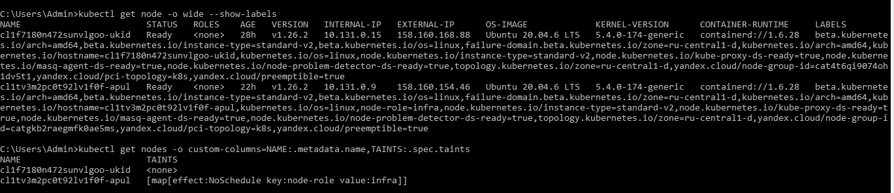
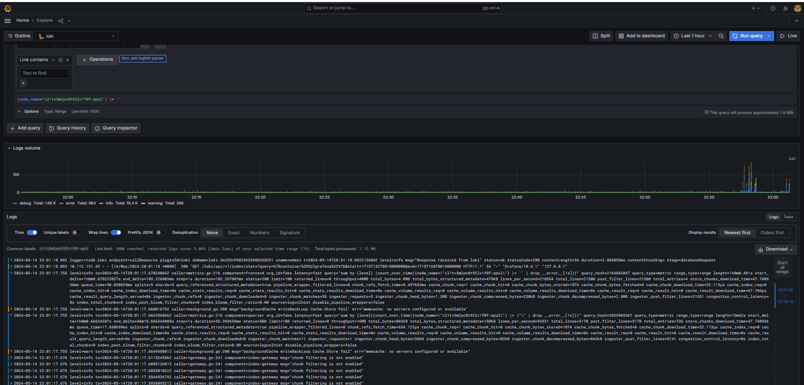

# Репозиторий для выполнения домашних заданий курса "Инфраструктурная платформа на основе Kubernetes-2024-02" 
ДЗ#9 - Сервисы централизованного логирования для Kubernetes

cd ./kubernetes-logging
Получаем access_key к service_account

access_key:
  id: <not using>
  service_account_id: <not using>
  created_at: <not using>
  key_id: <using>  <--- AWS_ACCESS_KEY_ID
secret: <using>  <--- AWS_SECRET_ACCESS_KEY

export accessKeyId= "key_id: <using>  <--- AWS_ACCESS_KEY_ID"
export secretAccessKey= "secret: <using>  <--- AWS_SECRET_ACCESS_KEY"

cd ./kubernetes-logging/loki  
helmfile apply

cd ./kubernetes-logging/promtail  
helmfile apply

cd ./kubernetes-logging/grafana 
helmfile apply

для подключения к grafana

kubectl port-forward service/grafana 30000:80 --namespace homework
username:admin
password: kubectl get secret grafana -o json -n homework @base64d

